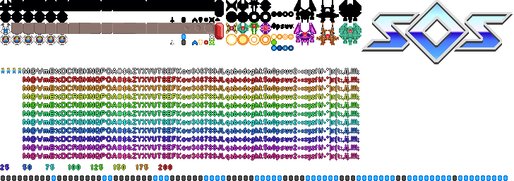

# *At this time, the postmortem is a W.I.P. I'll remove this once it is complete*

 

# SOS Postmortem

After the theme for the 2021 js13k competition was announced as "Space" I came up with the idea of creating a top down civilization type game where the goal would be to advance from the stone age, through to the space age, and achieve space travel.

I had spent some time (before the competition began) evaluating candidate game engines to use for my entry but after they all came up short in one way or another, I decided to write my own 2D game engine in JavaScript.

About a week into the competition I had a pretty solid start on my engine but it was soon obvious that the large scope that a full feature game engine would not work with the js13k size limits. Fro this point on I just mashed the appropriate parts of the engine into my main code-base.

Around the middle of week 2 I had designed the majority of my game and had created some code to procedurally generate circular game worlds using [cellular Automaton](https://en.wikipedia.org/wiki/Cellular_automaton) and [bit-masking](https://web.archive.org/web/20110714085421/http://www.angryfishstudios.com/2011/04/adventures-in-bitmasking/). After I began implementing mechanics and so forth it dawned on me that there was no way I would be able to cram all of the graphical assets required for such a game into a 13Kb zip file, even with on the fly recoloring of imagery inside the game.

Some more deep thinking took place (okay, a brain fart or two) and I decided that I'd just take the easy road and create a pixel-art space themed shoot-em-up. After spending a few days gathering and creating assets, defining requirements, and designing mechanics, I decided that it was feasible to proceed.

My list of requirements for SOS were:

- Colorful pixel-art.
- Actors.
- Object pooling.
- Robust graphical user interface.
- Basic particle effects.
- One-shot animations.
- Procedurally generated backgrounds.
- Parallax stars.
- Shadows for the player and enemies.
- Sound effects.
- Increasing difficulty level, maxing out at a certain point.
- Multiple enemies with simple AI.
- Persistent high scores.
- Persistent configurable options.

So how did I do? Good question. Let's find out.

 

## Colorful pixel-art

Earlier in the week I had been messing about with recoloring images using `getImageData()` and 'putImageData()' and I spent a few days getting that code into shape and integrated in the main code-base. It really ended up working so much better than I expected, and it was around this time that I also got the mad idea to basically render a large logo for the game using canvas line drawing and gradient fills. Once implemented, it was really spectacular, and comparing the code required vs having an actual image for the logo, it shaved 1601 bytes from the final zip file!

The asset generation code basically takes this image...

And uses it to create this image...

So how did I get from the first image to the second image? That's a very good question, and one I'll attempt to answer in a half coherent manner.

At first glance it looks like the first image is a solid black image but it is in fact an 8 colored indexed PNG file drawn in 7 shades of blue (#000001 - #000006).

Using `ctx.getImageData(x, y, w, h)`, you can get an array of bytes containing all of the pixel information for a given rectangle inside a context.

These bytes can then have their red, green, and blue values remapped using indexed color palettes, and then written back to the same context using `ctx.putImageData(imageData, x, y).

As I experimented with this it was annoying that I kept getting errors relating to `tainted canvases`, a really frustrating cross-origin web browser security feature.

Fortunately I discovered that if an image is embedded directly into an HTML file as a [data URL](https://developer.mozilla.org/en-US/docs/Web/HTTP/Basics_of_HTTP/Data_URIs), canvasses no longer become tainted when using `getImageData()` and `putImageData()`. It was also pleasantly suprising to find that my MIME encoded image (encoded using [Base64 Image](https://www.base64-image.de)) produced a smaller zip file than when I had the image stored as a normal PNG file. Go figure.

## Actors

## Object pooling

## Robust graphical user interface

## Basic particle effects

## One-shot animations

## Procedurally generated backgrounds

## Parallax stars

## Shadows for the player and enemies

## Sound effects

## Increasing difficulty level, maxing out at a certain point

## Multiple enemies with simple AI

## Persistent high scores

## Persistent configurable options
